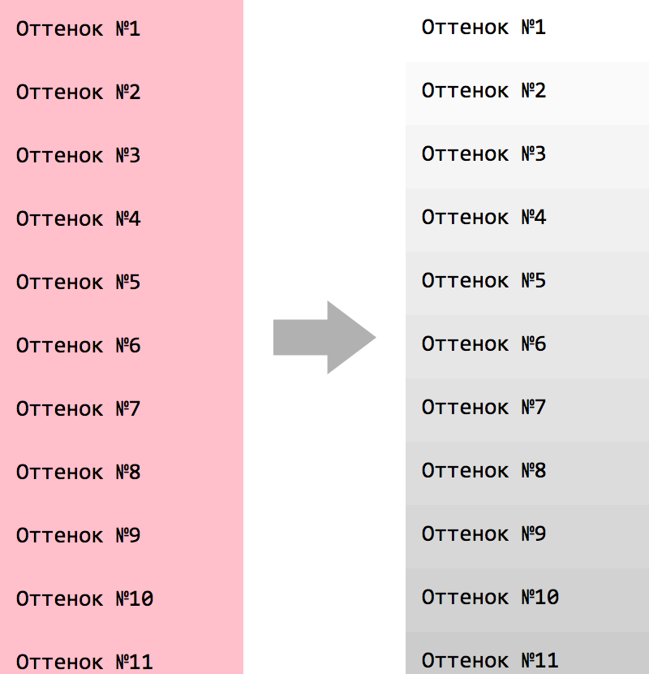

# 5 Bringing pages to life with jQuery

* Manipulating element class names
* Setting the content of DOM elements
* Getting and setting form element values
* Cloning DOM elements
* Modifying the DOM tree by adding, moving, or replacing elements

## 5.1 Changing element styling
### 5.1.1 Adding and removing class names
`className` вообще отстой, работать с классами как со строкой неудобно.

[`classList`](http://learn.javascript.ru/attributes-and-custom-properties#классы-в-виде-объекта-classlist), IE10+ лучше, но позволяет работать только с одним элементом, а jQuery может работать с коллекцией.

`addClass(String|Function)` — добавляет класс(-ы) ко всей коллекции.

`removeClass()` — удаляетт классы.

В методы можно передавать функцию, которая сможет обработать каждый элемент коллекции.

`toggleClass(String|Function, state)` — классы или ф-я возвращаюая классы в виде строки для переключения (каждый индивидуально). `state` говорит, добавлять или удалять классы.

См. кейс [`5.1.1_toggleClass.html`](5.1.1_toggleClass.html).

`hasClass()` — проверить наличие класса. `true`, если все эелменты сета имеют класс.

### 5.1.2 Getting and setting styles
`css(name, value)` — назначить стили. Работает подобно `attr`. Так же можно передавать функцию в качестве `value`.

Шорткат для изменения значения: `$('.expandable').css('width', '+=20')`.

Вместо `name, value` можно передавать объект сразу с пачкой CSS-свойств:

```js
$('p').css({
    margin: '1em',
    color: '#1933FF',
    opacity: function (index, currentValue) {
        return 1 - ((index % 10) / 10);
        // (index % 10) - чтоб значение было от 0 до 1 даже если будет больше 10 элементов в сете
    }
});
```

`css(name)` как геттер принимает строку или массив CSS-свойств и возвращает стили. Вернет строку или объект.

#### Getting and Setting Dimensions

## Вопросы и задания

### 50 оттенков серого
На [странице](tasks/50_shades_of_grey.html) имеется 50 блоков, все розовые. Используя метод `.css()` перекрасьте эти блоки так, чтобы получилось 50 оттенков серого:



